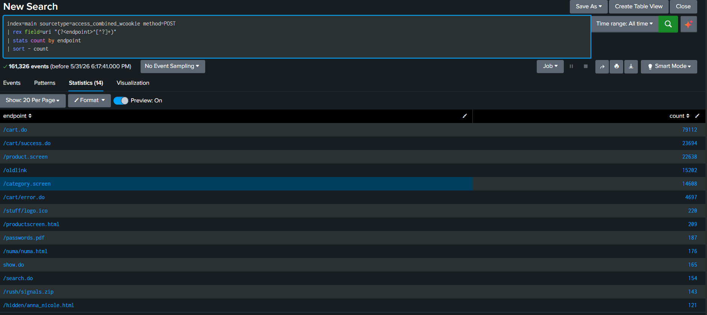
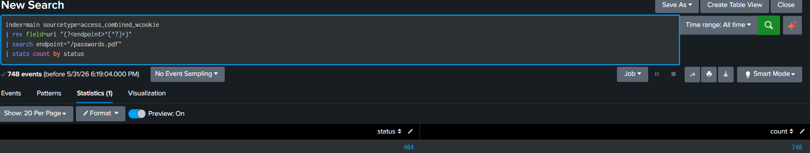
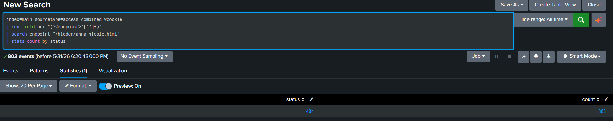
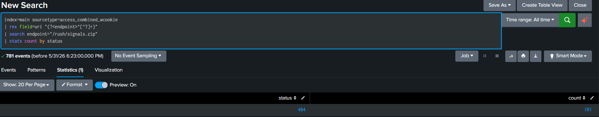
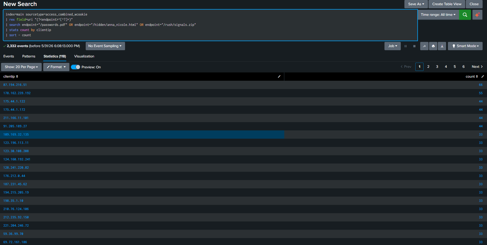

# Sensitive Resource Enumeration Investigation

## Investigation Information

**Platform:** Splunk Enterprise

**Dataset:** Splunk Tutorial Data

**Index:** main

**Sourcetype:** access_combined_wcookie

**Investigation Type:** Web Reconnaissance / Resource Enumeration

**Analyst:** Mukhtarbek Abdurazakov

---

# Objective

Identify attempts to access potentially sensitive or hidden web resources and determine whether any confidential content was successfully accessed.

---

# Step 1: Identify Top POST Endpoints

Query:

```spl
index=main sourcetype=access_combined_wcookie method=POST
| stats count by uri
| sort - count
```

Screenshot:

```markdown

```

Purpose:

* Identify heavily used POST endpoints.
* Establish a baseline of normal application behavior.

---

# Step 2: Normalize Endpoints

Query:

```spl
index=main sourcetype=access_combined_wcookie method=POST
| rex field=uri "(?<endpoint>^[^?]+)"
| stats count by endpoint
| sort - count
```

Screenshot:

```markdown

```

Finding:

Normal application activity was observed:

* /cart.do
* /cart/success.do
* /product.screen
* /category.screen

Several unusual resources were also identified.

---

# Step 3: Investigate passwords.pdf

Query:

```spl
index=main sourcetype=access_combined_wcookie
| rex field=uri "(?<endpoint>^[^?]+)"
| search endpoint="/passwords.pdf"
| stats count by status
```

Result:

```text
404    748
```

Screenshot:

```markdown

```

Finding:

748 requests attempted to access passwords.pdf.

All requests returned HTTP 404.

---

# Step 4: Investigate hidden/anna_nicole.html

Query:

```spl
index=main sourcetype=access_combined_wcookie
| rex field=uri "(?<endpoint>^[^?]+)"
| search endpoint="/hidden/anna_nicole.html"
| stats count by status
```

Result:

```text
404    803
```

Screenshot:

```markdown

```

Finding:

803 requests attempted to access the hidden resource.

All requests returned HTTP 404.

---

# Step 5: Investigate rush/signals.zip

Query:

```spl
index=main sourcetype=access_combined_wcookie
| rex field=uri "(?<endpoint>^[^?]+)"
| search endpoint="/rush/signals.zip"
| stats count by status
```

Result:

```text
404    781
```

Screenshot:

```markdown

```

Finding:

781 requests attempted to access the archive.

All requests returned HTTP 404.

---

# Step 6: Identify Top Scanner IPs

Query:

```spl
index=main sourcetype=access_combined_wcookie
| rex field=uri "(?<endpoint>^[^?]+)"
| search endpoint="/passwords.pdf" OR endpoint="/hidden/anna_nicole.html" OR endpoint="/rush/signals.zip"
| stats count by clientip
| sort - count
```

Screenshot:

```markdown

```

Notable IP addresses:

* 87.194.216.51
* 128.241.220.82
* 211.166.11.101

These IPs also appeared during previous web activity investigations.

---

# Findings

Analysis identified repeated requests for potentially sensitive resources:

* /passwords.pdf
* /hidden/anna_nicole.html
* /rush/signals.zip

The resources were requested hundreds of times by multiple clients.

All requests returned HTTP 404 responses.

No successful access to the resources was observed.

Several IPs involved in this activity were also identified in previous web investigations, indicating possible automated scanning or reconnaissance behavior.

---

# Conclusion

The observed activity is consistent with web resource enumeration and reconnaissance.

Multiple clients attempted to discover potentially sensitive files and hidden content.

All requests resulted in HTTP 404 responses, indicating that the resources were unavailable and no evidence of successful disclosure was observed.

---

# MITRE ATT&CK Mapping

**TA0043 – Reconnaissance**

**T1595 – Active Scanning**

---

# Skills Demonstrated

* Splunk SPL
* Web Log Analysis
* Threat Hunting
* Resource Enumeration Detection
* Reconnaissance Analysis
* Data Correlation
* Security Investigation Documentation

