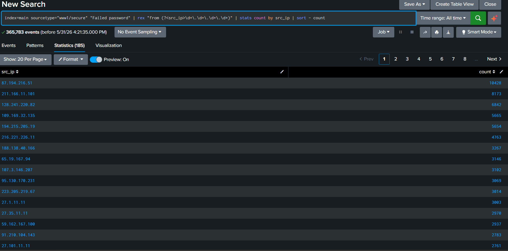
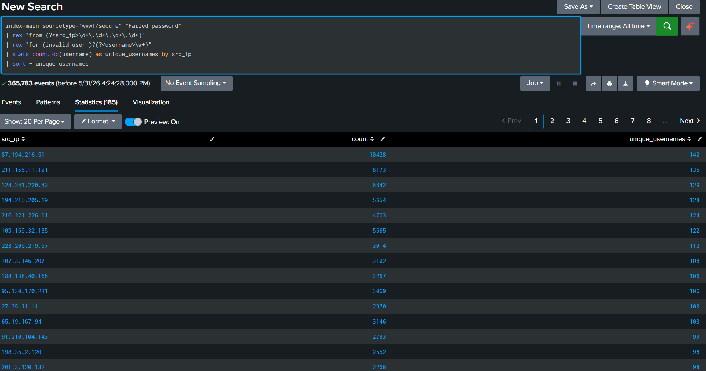
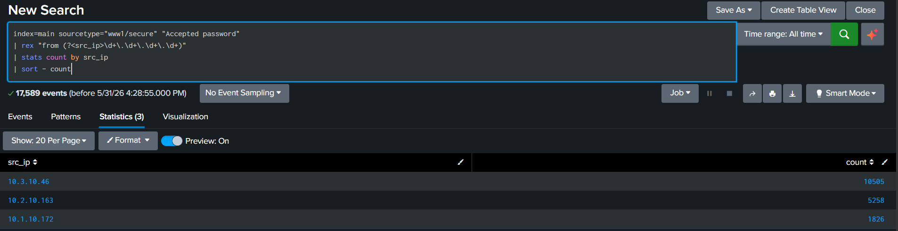
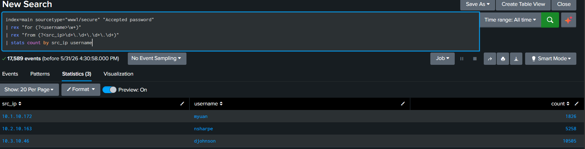

# SSH Authentication Investigation

## Objective

Investigate SSH authentication activity to identify potential brute-force attacks, determine which accounts were targeted, and assess whether any external attackers successfully authenticated.

## Data Source

**Index:** main

**Sourcetype:** www1/secure

The dataset contains SSH authentication logs including successful and failed login attempts.

---

## Investigation Methodology

### Step 1: Identify Failed Authentication Activity

Query:

```spl
index=main sourcetype="www1/secure" "Failed password"
```

Result:

* 365,783 failed authentication events were identified.

---

### Step 2: Identify Top Source IP Addresses

Query:

```spl
index=main sourcetype="www1/secure" "Failed password"
| rex "from (?<src_ip>\d+\.\d+\.\d+\.\d+)"
| stats count by src_ip
| sort - count
```

Purpose:

* Identify the most active sources generating failed login attempts.
* Establish a list of potentially suspicious IP addresses.

Screenshot:



---

### Step 3: Identify Usernames Targeted by Attackers

Query:

```spl
index=main sourcetype="www1/secure" "Failed password"
| rex "from (?<src_ip>\d+\.\d+\.\d+\.\d+)"
| rex "for (invalid user )?(?<username>\w+)"
| stats count dc(username) as unique_usernames by src_ip
| sort - unique_usernames
```

Finding:

Source IP **194.8.74.23** generated:

* 1,452 failed login attempts
* 74 unique usernames targeted

Examples of targeted usernames:

* root
* apache
* mongodb
* mail
* appserver
* testuser

Screenshot:



---

### Step 4: Investigate Successful Authentications

Query:

```spl
index=main sourcetype="www1/secure" "Accepted password"
```

Result:

* 17,589 successful authentication events were identified.

---

### Step 5: Identify Successful Login Sources

Query:

```spl
index=main sourcetype="www1/secure" "Accepted password"
| rex "from (?<src_ip>\d+\.\d+\.\d+\.\d+)"
| stats count by src_ip
| sort - count
```

Result:

| Source IP   | Successful Logins |
| ----------- | ----------------: |
| 10.3.10.46  |            10,505 |
| 10.2.10.163 |             5,258 |
| 10.1.10.172 |             1,826 |

Observation:

All successful logins originated from internal private-address hosts in the 10.x.x.x range.

Screenshot:



---

### Step 6: Correlate Successful Logins with User Accounts

Query:

```spl
index=main sourcetype="www1/secure" "Accepted password"
| rex "for (?<username>\w+)"
| rex "from (?<src_ip>\d+\.\d+\.\d+\.\d+)"
| stats count by src_ip username
```

Result:

| Source IP   | Username | Successful Logins |
| ----------- | -------- | ----------------: |
| 10.1.10.172 | myuan    |             1,826 |
| 10.2.10.163 | nsharpe  |             5,258 |
| 10.3.10.46  | djohnson |            10,505 |

Observation:

Successful authentication activity was limited to three internal users and three internal hosts.

Screenshot:


---

## Findings

Analysis identified multiple external IP addresses exhibiting behavior consistent with SSH brute-force attacks.

One notable source, **194.8.74.23**, generated:

* 1,452 failed authentication attempts
* 74 unique usernames targeted
* No successful authentications

Additional external IP addresses exhibited similar behavior, including repeated password guessing against administrative and service accounts.

Investigation of successful login activity showed that all successful authentications originated from three internal hosts:

* 10.3.10.46 (djohnson)
* 10.2.10.163 (nsharpe)
* 10.1.10.172 (myuan)

No successful authentication events were identified from the external attacking IP addresses.

---

## Conclusion

The observed activity is consistent with automated SSH brute-force and credential-guessing behavior.

Although numerous failed authentication attempts were observed from external IP addresses, there was no evidence that these sources successfully authenticated.

Based on the available evidence, the brute-force activity was unsuccessful and did not result in a confirmed compromise.

---

## MITRE ATT&CK Mapping

**TA0006 – Credential Access**

**T1110 – Brute Force**

**T1110.001 – Password Guessing**

---

## Skills Demonstrated

* Splunk SPL
* Authentication Log Analysis
* Threat Hunting
* SSH Brute-Force Detection
* Data Correlation
* Incident Documentation
* Security Investigation Methodology
