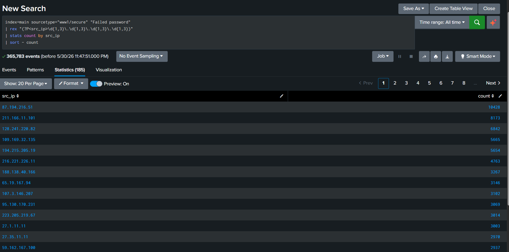
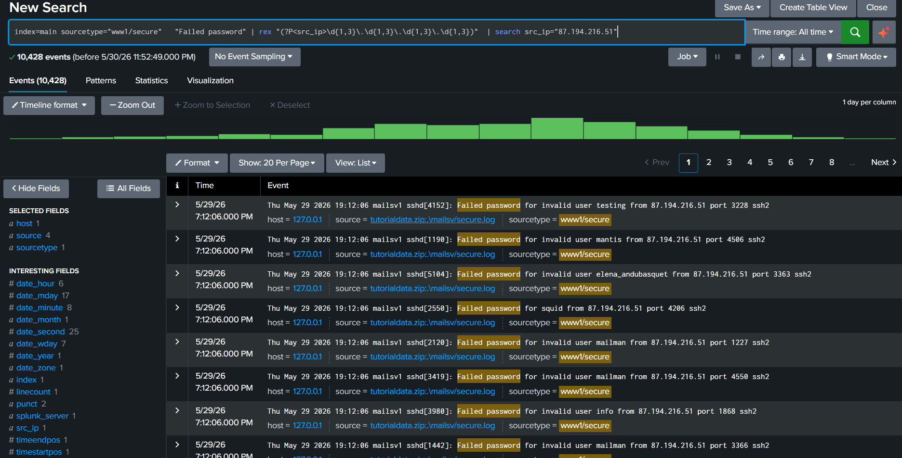
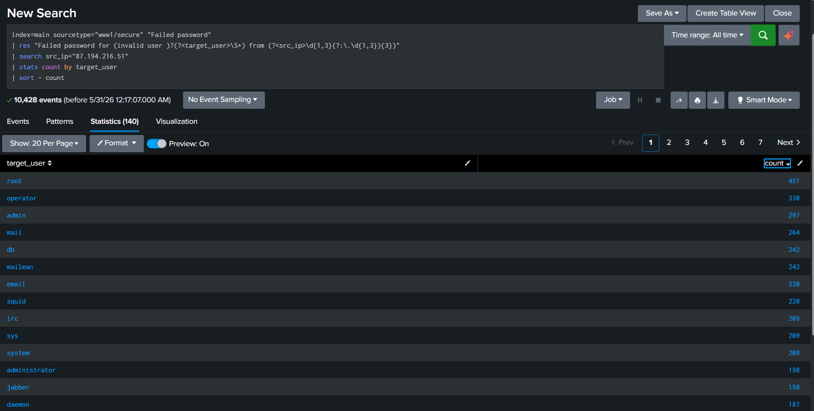

# SSH Brute Force Investigation in Splunk

## Objective
Investigate repeated failed SSH login attempts.

## Dataset
Splunk tutorialdata, sourcetype=www1/secure

## Investigation Steps

1. Identified authentication logs in the `www1/secure` sourcetype.
2. Searched for failed SSH password attempts.
3. Extracted source IP addresses using the `rex` command.
4. Counted failed login attempts by source IP.
5. Reviewed the most active IP addresses for suspicious behavior.

## SPL Search

## Investigation Queries

### Query 1 – Identify Top Source IPs
```spl
index=main sourcetype="www1/secure" "Failed password"
| rex "(?<src_ip>\d{1,3}\.\d{1,3}\.\d{1,3}\.\d{1,3})"
| stats count by src_ip
| sort - count
```
Purpose: Identify the IP addresses generating the highest number of failed SSH authentication attempts.

### Query 2 – Investigate Suspicious IP
```spl
index=main sourcetype="www1/secure" "Failed password"
| rex "(?<src_ip>\d{1,3}\.\d{1,3}\.\d{1,3}\.\d{1,3})"
| search src_ip="87.194.216.51"
```
Purpose: Review the failed login attempts associated with the identified source IP and determine which usernames were targeted.

### Query 3 – Analyze targeted usernames
```spl
index=main sourcetype="www1/secure" "Failed password"
| rex "Failed password for (invalid user )?(?<target_user>\S+) from (?<src_ip>\d{1,3}(?:\.\d{1,3}){3})"
| search src_ip="87.194.216.51"
| stats count by target_user
| sort - count
```
Purpose: Extract and count the usernames targeted by the suspicious source IP to understand which accounts were attacked most frequently.

## Findings

- Source IP: 87.194.216.51
- Generated 10,428 failed SSH authentication attempts.
- The IP produced the highest number of failed login events in the dataset.
- Multiple usernames were targeted, including:
  - testing
  - mantis
  - elena_andubasquet
  - squid
  - mailman
  - info
- Repeated authentication failures were observed across many different accounts.

## Evidence

### Top Source IP Analysis



### Failed Login Events



### Targeted Usernames



## SOC Analyst Conclusion

The source IP 87.194.216.51 exhibited behavior consistent with an SSH brute-force or password-spraying attack.

The IP generated 10,428 failed authentication attempts and targeted multiple user accounts. Based on the volume and pattern of activity, the source should be considered highly suspicious and investigated further.

## Recommendation

- Monitor the source IP for future activity.
- Investigate whether any successful logins originated from the same IP.
- Review affected usernames and authentication logs.
- Consider blocking the IP if malicious activity is confirmed.
