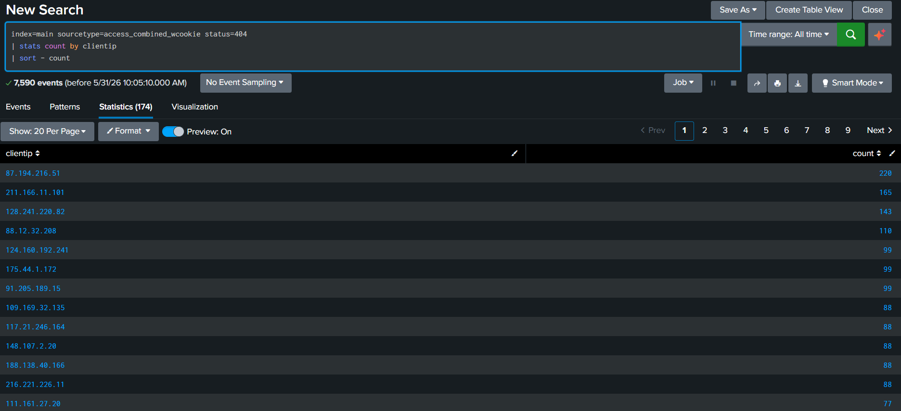
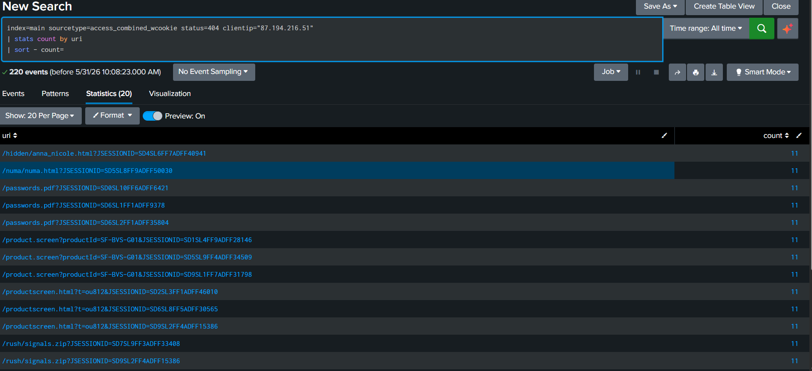

# Web 404 Enumeration Investigation

## Objective

Investigate a client IP generating a large number of HTTP 404 (Not Found) responses and determine whether the activity may indicate web enumeration or scanning.

## Dataset

Splunk tutorialdata, sourcetype=access_combined_wcookie

## Investigation Steps

1. Identified client IPs generating HTTP 404 responses.
2. Ranked client IPs by the number of 404 events.
3. Selected the most active client IP for further investigation.
4. Reviewed requested URIs associated with the suspicious client.
5. Assessed whether the activity was consistent with web enumeration behavior.

## Investigation Queries

### Query 1 – Identify Top 404 Sources

```spl
index=main sourcetype=access_combined_wcookie status=404
| stats count by clientip
| sort - count
```

Purpose: Identify client IPs responsible for the highest number of HTTP 404 responses.

### Query 2 – Analyze Requested URIs

```spl
index=main sourcetype=access_combined_wcookie status=404 clientip="87.194.216.51"
| stats count by uri
| sort - count
```

Purpose: Determine which resources were repeatedly requested by the client.

## Findings

* Client IP: 87.194.216.51
* Generated 220 HTTP 404 (Not Found) responses.
* Produced the highest number of 404 events in the dataset.
* Frequently requested resources that were unavailable on the server, including:

  * /hidden/anna_nicole.html
  * /numa/numa.html
  * /passwords.pdf
  * /rush/signals.zip
  * Multiple product-related pages that returned HTTP 404 responses.
* Several resources were requested repeatedly, suggesting automated activity or persistent attempts to access unavailable content.

## Evidence

### Top 404 Client IPs



### Requested URIs



## SOC Analyst Conclusion

The client IP 87.194.216.51 generated the highest volume of HTTP 404 responses observed in the dataset.

The client repeatedly requested resources that were not available on the server, including hidden pages, archived content, and downloadable files. While this activity may indicate automated browsing, web crawling, or reconnaissance behavior, additional investigation would be required to determine malicious intent.

The activity should be monitored and correlated with other web requests from the same source IP.

```
```
