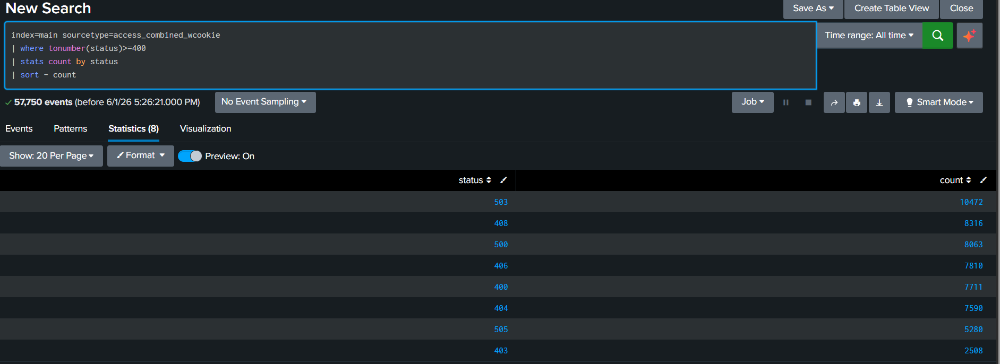
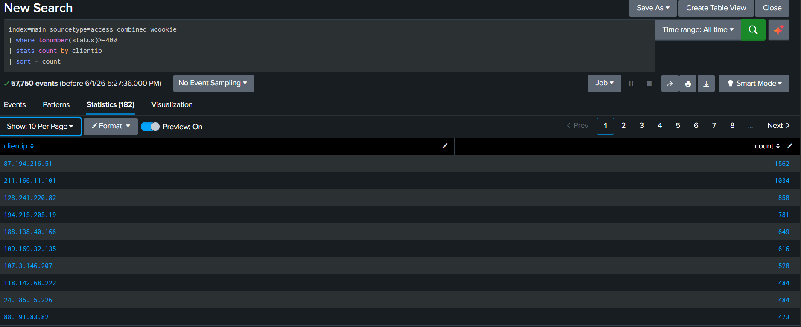
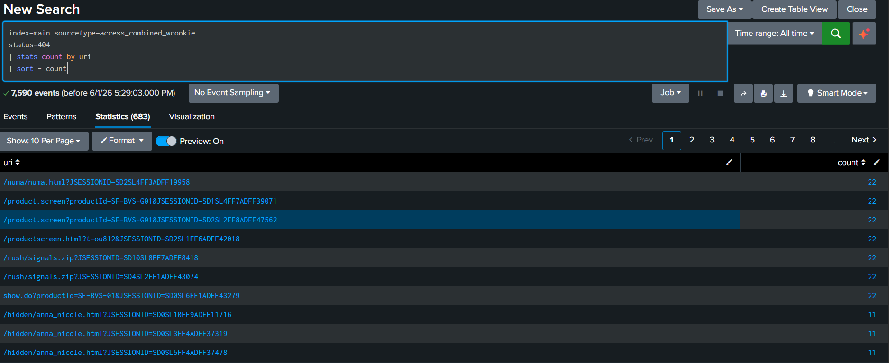
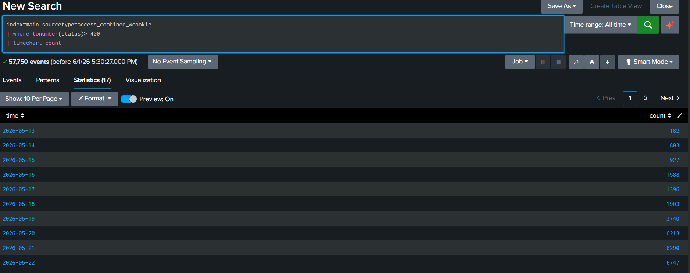
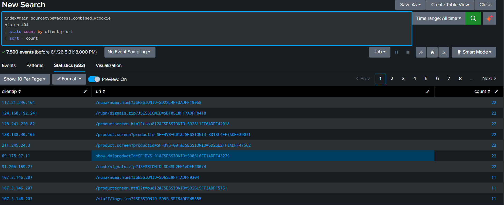

# Web Application Error Analysis

## Objective

Analyze web application error responses to identify:

* Common HTTP error codes
* Sources generating excessive errors
* Frequently requested missing resources
* Potential scanning or enumeration activity
* Indicators of application instability

---

## Data Source

**Index:** main

**Sourcetype:** access_combined_wcookie

**Log Type:** Apache Web Access Logs

---

## Investigation Methodology

### Error Code Distribution

```spl
index=main sourcetype=access_combined_wcookie
| where tonumber(status)>=400
| stats count by status
| sort - count
```

### Top Error-Generating IP Addresses

```spl
index=main sourcetype=access_combined_wcookie
| where tonumber(status)>=400
| stats count by clientip
| sort - count
```

### Most Requested Missing Resources

```spl
index=main sourcetype=access_combined_wcookie
status=404
| stats count by uri
| sort - count
```

### Error Activity Timeline

```spl
index=main sourcetype=access_combined_wcookie
| where tonumber(status)>=400
| timechart count
```

### Client IP and URI Correlation

```spl
index=main sourcetype=access_combined_wcookie
status=404
| stats count by clientip uri
| sort - count
```

## Screenshots:

Error Code Distribution



Top Error-Generating IPs



Most Requested Missing Resources



Error Timeline



IP and URI Correlation




## Findings

### Finding 1: High Volume of Error Responses

The dataset contained a significant number of HTTP error responses, including:

| Status Code | Meaning                    |
| ----------- | -------------------------- |
| 400         | Bad Request                |
| 403         | Forbidden                  |
| 404         | Not Found                  |
| 406         | Not Acceptable             |
| 408         | Request Timeout            |
| 500         | Internal Server Error      |
| 503         | Service Unavailable        |
| 505         | HTTP Version Not Supported |

The most frequently observed error code was HTTP 503 (Service Unavailable).

### Finding 2: Multiple Client IPs Generated Large Numbers of Errors

Several client IP addresses generated a disproportionately high number of error responses, warranting additional investigation.

### Finding 3: Repeated Requests for Missing Resources

Numerous requests resulted in HTTP 404 responses, indicating attempts to access resources that were not available on the web server.

### Finding 4: Evidence of Potential Enumeration Activity

Repeated requests for non-existent resources may indicate automated scanning or web content enumeration activity.

---

## Security Impact

Potential risks identified include:

* Web reconnaissance activity
* Automated scanning attempts
* Misconfigured client requests
* Application instability resulting in 500 and 503 responses
* Excessive requests to unavailable resources

While error responses alone do not confirm malicious activity, they may provide indicators of suspicious behavior that require further analysis.

---

## Recommendations

1. Monitor recurring error-generating IP addresses.
2. Investigate repeated requests for non-existent resources.
3. Review application components responsible for 500 and 503 responses.
4. Implement alerting for spikes in web application errors.
5. Correlate web errors with authentication and network logs to identify broader attack patterns.

---

## Skills Demonstrated

* Splunk SPL
* Log Analysis
* Web Application Monitoring
* HTTP Status Code Analysis
* Threat Hunting
* Security Investigation Documentation
* GitHub Portfolio Reporting
